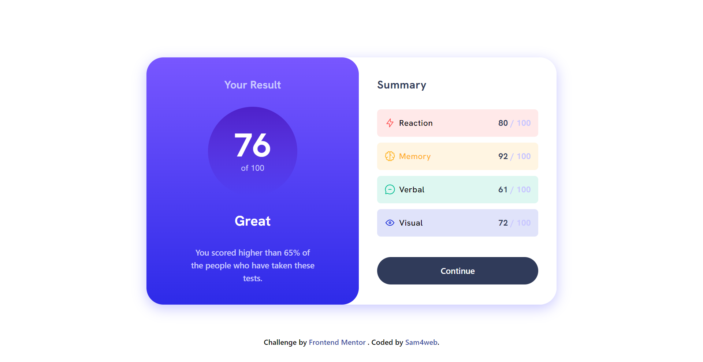

## Frontend Mentor - Results summary component solution

This is a solution to the [Results summary component challenge on Frontend Mentor](https://www.frontendmentor.io/challenges/results-summary-component-CE_K6s0maV). Frontend Mentor challenges help you improve your coding skills by building realistic projects.

### Table of contents

- [Overview](#overview)
  - [The challenge](#the-challenge)
  - [Screenshot](#screenshot)
  - [Links](#links)
- [Built with](#built-with)
- [Author](#author)

### Overview

#### The challenge

Users should be able to:

- View the optimal layout for the interface depending on their device's screen size
- See hover and focus states for all interactive elements on the page

#### Screenshot

#### Links

- Solution : [Solution URL](https://www.frontendmentor.io/solutions/results-summary-component-YOXnHJfDUd)
- Live Site : [Live Site URL](https://sam4web.github.io/results_summary_component/)

### Built with

- Semantic HTML5 markup
- CSS custom properties
- Flexbox
- Mobile-first workflow
- [Tailwind CSS](https://tailwindcss.com/)

### Author

- Sijal Manandhar
- Github - [sam4web](https://github.com/sam4web/)
- Frontend Mentor - [@sam4web](https://www.frontendmentor.io/profile/sam4web)
